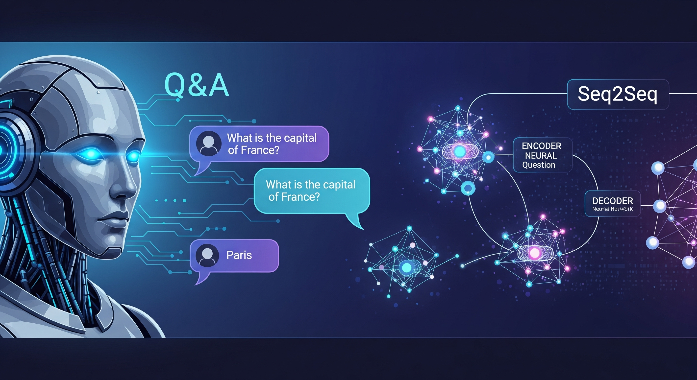

# PLN-1 - Procesamiento de Lenguaje Natural

Ejercicios de la especialización en IA - UBA (Universidad Nacional de Buenos Aires) - Materia: Procesamiento de Lenguaje Natural 1

## Desafío 1 - Vectorización de documentos y clasificación
\
Procesamiento de libros de Stephen King usando técnicas de vectorización (TF-IDF). Análisis de similaridad entre documentos y entrenamiento de modelos Naive Bayes para clasificación. También exploración de similaridad entre palabras usando la matriz transpuesta.\
Notebook: [Desafio_1_Solucion.ipynb](desafio_1/Desafio_1_Solucion.ipynb)

## Desafío 2 - Word embeddings con Gensim
\
Creación de vectores de palabras usando Gensim con Word2Vec. Exploración de similitudes semánticas, tests de analogías y visualización de embeddings en 2D. Análisis de relaciones entre palabras en el espacio vectorial.\
Notebook: [Desafio_2_Solucion.ipynb](desafio_2/Desafio_2_Solucion.ipynb)

## Desafío 3 - Modelo de lenguaje con redes neuronales
\
Desarrollo de un modelo de lenguaje usando LSTM para generar texto. Entrenamiento con libros de John Grisham, implementando arquitecturas recurrentes para predicción de secuencias y generación de texto automática.\
Notebook: [Desafio_3_Solucion.ipynb](desafio_3/Desafio_3_Solucion.ipynb)

## Desafío 4 - Bot QA con arquitectura Seq2Seq
\
Implementación de un chatbot de preguntas y respuestas usando arquitectura encoder-decoder con LSTM. Entrenamiento con dataset de voluntarios para generar respuestas automáticas a consultas.\
Notebook: [Desafio_4_Solucion.ipynb](desafio_4/Desafio_4_Solucion.ipynb)

# ¡Gracias!
Contacto _paola.cartala@gmail.com_ :smile: